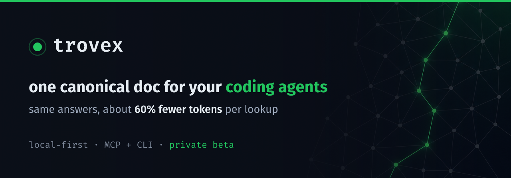

<p align="center">
  
</p>

# trovex

**One source of truth for your coding agents' docs. Same answers, about 60% fewer tokens.**

Your coding agents (Claude Code, Cursor, Windsurf, Zed, any MCP client) reread the repo
every session to work out which `.md` is current, then answer from a guess. You pay for
that on every session, every agent, every teammate.

trovex indexes your repo's markdown and exposes one MCP tool. Your agent asks a question;
trovex returns the single current doc that answers it as a `path:line` pointer with a
freshness marker (canonical / stale / duplicate), and serves just the section that answers
instead of the whole file. Agents also write what they learn back through one shared point,
so every agent and teammate reads the same source of truth instead of re-deriving it.

About **60% fewer tokens** on doc lookups, same context quality. Runs locally: vectors in
SQLite, embeddings via ONNX, no cloud or API keys.

## Quick start

trovex is in [private beta](#private-beta). Once you have repo access, there's no clone and
no `pip install` step — `uv tool install` builds it straight from git and puts `trovex` on
your PATH:

```bash
uv tool install git+https://github.com/TsukumoHQ/trovex   # one-time, no clone

trovex index /path/to/your/repo        # index your markdown (~1 min)
trovex search "how do we roll back a deploy?"   # ask — prints the tokens it saved
trovex serve                           # wire into your agent: MCP at /mcp, dashboard at /savings
```

Don't have `uv`? It's a one-line install: `curl -LsSf https://astral.sh/uv/install.sh | sh`
(or `brew install uv`).

The `search` step is the fast way to see the point: it returns the one canonical doc and
prints how many tokens that saved versus reading the top few candidates. Once trovex is
wired into your agent over MCP, the same numbers accumulate on the savings dashboard at
`http://localhost:8765/savings`.

> Prefer not to install anything yet? `uvx --from git+https://github.com/TsukumoHQ/trovex trovex search "..."`
> runs a single command in a throwaway environment. After the public launch, that shortens
> to `uvx trovex`.

## Wire it into your agent

trovex is an MCP server. Point your client at `http://localhost:8765/mcp` after `trovex serve`.
Per-client setup (Claude Code, Cursor, Windsurf, Cline, Zed, Roo) is at
[trovex.dev/for](https://trovex.dev/for/). For Claude Code:

```bash
claude mcp add --transport http trovex http://localhost:8765/mcp
```

## MCP tools

- `trovex(q)` — route a question to the right on-disk `.md` and get back `path:line` pointers
  with freshness markers, not a pile of files to rank.
- `trovex_write(content, kind?, doc_id?, tags?)` / `trovex_read(query | doc_id, section?)` —
  docs owned *inside* trovex. An agent stores a record (an incident, a decision, "what
  actually worked") once; every other agent and a second dev read it back as content
  (optionally just one section) instead of re-deriving it. See [`REFONTE.md`](REFONTE.md).
- `trovex_search(query, k?, tags?)` — passage-level retrieval across the store with tag
  filters, for when you want the top matching chunks rather than one canonical doc.

Humans read trovex-owned docs at `/doc/{id}` in the rendered reader. To make agents route
`.md` writes through `trovex_write` instead of the disk, install the PreToolUse hook
`deploy/hooks/trovex-md-guard.sh` and carve out exceptions in `.trovexignore`.

## How it compares

- vs `CLAUDE.md` / `AGENTS.md`: one static file that goes stale and can't route a question
  to the right doc, vs many docs kept canonical and served per query. [More](https://trovex.dev/vs/claude-md/).
- vs `repomix` / files-to-prompt: pack the whole repo into the window vs retrieve the one
  answer. [More](https://trovex.dev/vs/repomix/).
- vs a vector DB / plain RAG: a ranked pile of candidate chunks with no freshness signal vs
  one current doc with an explicit marker. [More](https://trovex.dev/vs/vector-db-rag/).

The reasoning behind the ~60% number is written up in
[the token cost of agents rereading docs](https://trovex.dev/blog/the-token-cost-of-agents-rereading-docs/).

## Stack

- Python 3.11 + uv
- FastAPI (MCP HTTP + server-rendered HTML UI)
- fastembed (local embeddings, ONNX under the hood)
- sqlite-vec (vector search in SQLite)
- Jinja2 + HTMX (UI, no build step)

## Private beta

trovex is in private beta. The repo is gated while we work with a small group of early
testers. [Request access at trovex.dev](https://trovex.dev) and we'll get you set up. Early
testers get hands-on onboarding and a direct say in the roadmap.

## License

trovex is licensed under the **GNU AGPL-3.0-or-later** (see [`LICENSE`](LICENSE)). You can
self-host and modify it freely; if you run a modified version as a network service, AGPL
requires you to share your changes.

## Working with a team?

trovex is free to run yourself. If your team is rolling out coding agents at scale and wants
hands-on help doing it well, or to embed and host a modified trovex privately without the
AGPL's copyleft obligations, that's what the consulting is for.
[Reach out](https://tsukumo.ch/consulting/?utm_source=trovex&utm_medium=oss-suite&utm_campaign=consulting):
tsukumo, the team behind trovex.
